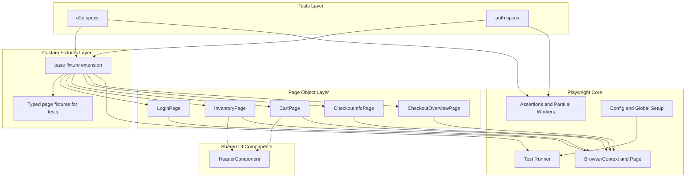
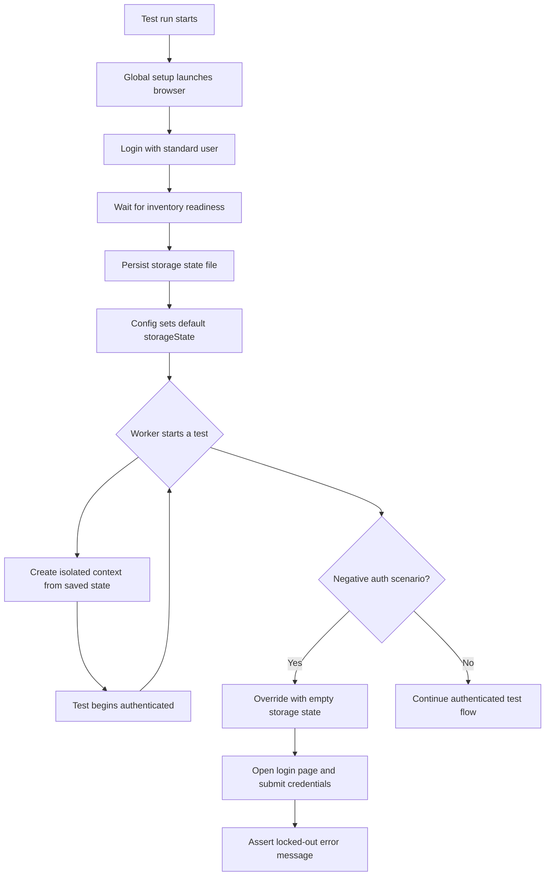
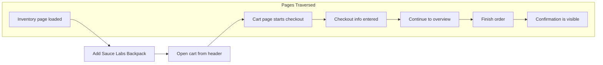

# Test Architecture Diagrams

## 1) High-Level Framework Architecture



## 2) Authentication Lifecycle



## 3) Checkout Happy Path End-to-End Journey



---

# SauceDemo Playwright Automation Suite

## Overview

This repository contains an end-to-end UI automation framework built with **Playwright and TypeScript** targeting the public SauceDemo application.

The objective of this suite is to demonstrate:

* scalable Page Object Model architecture
* deterministic test isolation and parallel execution
* resilient selector and navigation strategies
* maintainable TypeScript design
* structured use of LLMs as engineering planning tools

The framework is intentionally designed to prioritise **stability, readability, and extensibility** over raw test count.

---

## Prerequisites

* Node.js ≥ 18
* npm ≥ 9

Install dependencies:

```bash
npm install
npx playwright install --with-deps
```

---

## How to Run Tests

Run the full suite:

```bash
npx playwright test
```

Run a specific file:

```bash
npx playwright test tests/e2e/checkout-flow.spec.ts
```

Run by test name:

```bash
npx playwright test -g "standard user can complete checkout"
```

Repeat execution to validate stability:

```bash
npx playwright test --repeat-each=10
```

---

## Test Report

After execution, open the HTML report:

```bash
npx playwright show-report
```

Artifacts such as screenshots and traces are saved in:

```
test-results/
```

---

## Framework Architecture

### Execution Model

The suite is designed as a **stateless, fully parallel Playwright framework**.

Key characteristics:

* tests run in isolated browser contexts
* authentication state is generated once in global setup
* storage state is reused across workers
* test order independence is enforced

This architecture ensures:

* faster execution
* reduced flakiness
* horizontal CI scalability

---

### Page Object Model Structure

Page Objects are organised by **user capability boundaries** rather than DOM structure.

Implemented objects:

* LoginPage
* InventoryPage
* CartPage
* CheckoutInfoPage
* CheckoutOverviewPage
* HeaderComponent (shared UI composition)

Design principles:

* Page Objects encapsulate interaction logic only
* assertions remain inside test specifications
* shared UI elements are modelled as reusable components
* selectors prioritise `data-test` and `id` attributes

This improves long-term maintainability and resilience to UI changes.

---

### Fixture Strategy

A custom base fixture extends Playwright’s test object to provide:

* dependency injection of Page Objects
* clean test signatures
* test-scoped isolation

Authentication-specific scenarios override the global storage state to ensure realistic validation of login behaviour.

---

### Parallel Execution Strategy

* `fullyParallel` enabled
* multi-browser matrix: Chromium and Firefox
* projects execute sequentially, workers execute in parallel

This balances execution speed with deterministic debugging in public test environments.

---

### Timeout and Stability Strategy

SauceDemo is a publicly hosted demo application and exhibits variable response times.

To mitigate environmental instability:

* explicit readiness waits are implemented after navigation
* action and navigation timeouts are tuned conservatively
* traces and screenshots are collected on failure

These trade-offs prioritise **suite reliability over aggressive timing assumptions.**

---

## Performance Dashboard Findings

### 📊 Timing Measurements

Collected using:

```
npx playwright test --repeat-each=10
```

Total execution time: **~5.5 minutes**

#### Chromium Runs

6025 ms
6243 ms
6288 ms
6141 ms
6210 ms
6115 ms
6066 ms
6377 ms
6069 ms
6136 ms

#### Firefox Runs

6645 ms
7346 ms
7040 ms
8425 ms
7051 ms
6906 ms
7423 ms
9448 ms
8110 ms
8430 ms

### 📈 Calculated Averages

* Chromium average: **~6177 ms**
* Firefox average: **~7647 ms**
* Overall average: **~6912 ms**

### 🔎 Observations

* Firefox shows consistently slower and more variable load times
* Chromium demonstrates tighter clustering and more predictable performance
* Inventory load duration exceeds typical UX expectations (2–3 seconds)

### 💡 Potential Improvements

* analyse API response latency
* optimise asset delivery strategy
* consider progressive rendering patterns
* profile JavaScript execution differences between engines

These findings illustrate how the automation suite can support **performance-aware quality engineering decisions.**

---

## Design Trade-Offs

Given the time-boxed nature of the exercise:

* authentication reuse was prioritised over exhaustive login coverage
* visual validations were limited in favour of functional reliability
* timeout thresholds were calibrated to reduce false negatives
* selector strategy avoided brittle positional targeting

The resulting framework aims to maximise **signal quality within constrained implementation time.**

---

## Playwright Configuration Rationale

The configuration prioritises deterministic parallel execution and resilience in a public test environment.

Key decisions:

* **Fully parallel execution** was enabled to reflect real CI scaling behaviour while maintaining strict test isolation through independent browser contexts.
* **Authentication state reuse** via global setup significantly reduces execution time and avoids repetitive login flows, while specific authentication tests explicitly override this state to validate error handling scenarios.
* **Multi-browser coverage** was limited to Chromium and Firefox to balance cross-engine confidence with execution stability and resource efficiency.
* **Failure observability** was enhanced through HTML reporting, automatic screenshots, and retained execution traces, enabling rapid root-cause analysis.
* **Timeout thresholds** were intentionally tuned to accommodate the variable latency of the publicly hosted SauceDemo environment, reducing false negatives while preserving meaningful performance assertions.

This configuration aims to model realistic enterprise automation constraints rather than optimising solely for local execution speed.


---

## LLM Usage

LLMs were used as **architectural planning assistants**, not code generators.

Their role included:

* validating framework structure
* identifying potential flakiness risks
* refining selector and fixture strategies
* stress-testing design decisions

All generated suggestions were manually reviewed, adapted, and validated through repeated execution runs.

---

## Repository Structure

```
tests/
pages/
fixtures/
test-data/
utils/
global.setup.ts
playwright.config.ts
```

This structure keeps domain abstractions clear and simplifies onboarding for future contributors.

---
